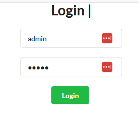
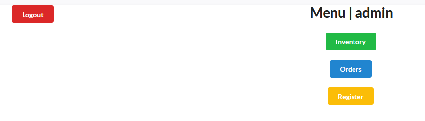
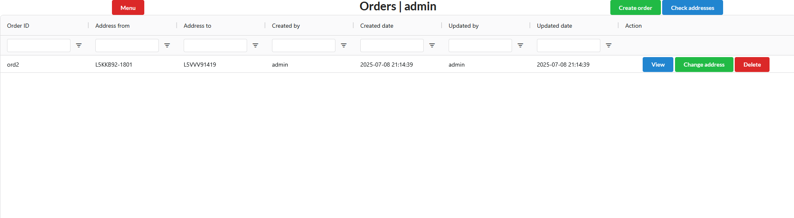
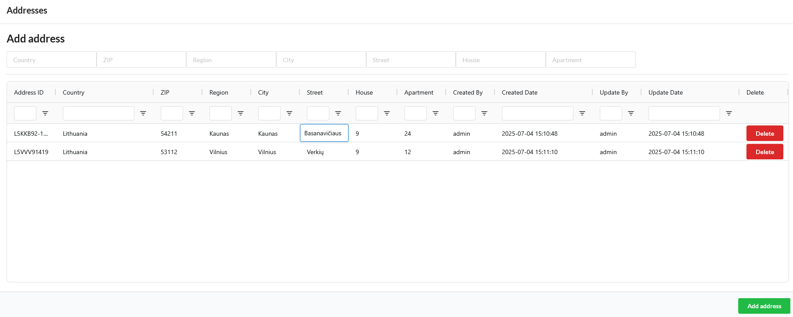

# Warehouse Management

## Description
A .NET React.JS web app for warehouse management. Uses Entity Framework and MySQL database

## Use Case
1. Person can check warehouse inventory.

2. Person can add/delete items in warehouse inventory.
3. Person can edit item's attributes (name, price, quantity).
4. Person can check the history of item's price/quantity.
5. Person can register new users and assign them accesability rights for features in the web app.
6. Person can check orders.
7. Person can add, delete and change orders.
8. Person can complete orders and save payslips of the order inside the project directory.

## Services used
### Front-End
1. React.js
2. [Semantic UI React](https://react.semantic-ui.com/).
3. [AG Grid](https://www.ag-grid.com/react-data-grid/getting-started/).
4. [Axios](https://www.npmjs.com/package/react-axios).
5. [Redux](https://github.com/reduxjs/redux).
### Back-End
.NET (C#) 7.
MySQL Entity Framework 7.

## DB scaffold commands
### Users
dotnet ef dbcontext scaffold "Server=localhost;Database=users;user=root;password=;" MySql.EntityFrameworkCore -o UsersDB -f
### Warehouse
dotnet ef dbcontext scaffold "Server=localhost;Database=warehouse;user=root;password=;" MySql.EntityFrameworkCore -o WarehouseDB -f
### Orders
dotnet ef dbcontext scaffold "Server=localhost;Database=orders;user=root;password=;" MySql.EntityFrameworkCore -o OrdersDB -f

## Instructions
Upload database in the same order as scaffold commands. 
Log in using the admin login (Username: admin, Password: admin) 
 
The menu page allows you to Logout, access the warehouse inventory, order list and register a new user: 
 
### Inventory page
In the inventory page you can view all of the items that are in the warehouse. You can also create, delete and view details of an item. Additionally you can change certain information about the order, such as price nad quantity, by double clicking on the column field 
 
You can also customize this view by draging columns to your preference and filtering by them.
### Product Creation
To Create a new product in your warehouse press on the "Create Product" button in the top right corner of the screen. 
A new panel will open where you can input the info of your new product: 

### Product View
To view a specific product simply click on the blue "View" btton available on each listed product. 
In the product view you can see the product's information as well as it's price and quantity history: 
 
 

### Orders page
In the orders page you can view all orders that have been set up. from this page you can create new orders or change an existing product's addresses,  manage the product of the orders using the blue "View" button on each listed order and various addresses using the blue button on the top right corner. 
 
### Order View
In the order view panel you can see what products are in the order. You can also add additional products or delete them from the order. Once the order is ready to be confirmed, a user can press the blue "Complete" button to confirm the order and generate a PDF payslip of the order. 

### Address panel
In the address panel you can see all of the available addresses you can use when creating orders. You can also delete any unessecery addresses. In this panel you can also add any additional address. Most details can be changed in the grid layout, simply double click on the field you wish to alter. 

### Register user
The register page can be used to create a new user. You can also add rights to which pages the user has access to. 
